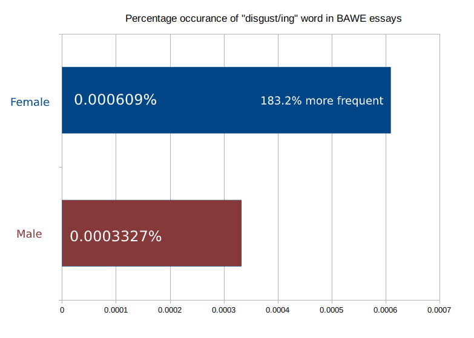

# Gender and "disgust/ing" word usage in BAWE (British Academic Written English Corpus) Essays

I pulled all the data from BAWE and ran simple word processing bash commands to see how common is the word "disgust(ing)" by males and females in those essays.

## Disclaimer

I'm not a scientist, statistician, natural language processing expert, or have a good idea what I am talking about. I'm just curious and wanted to see.

## Known Issue
I don't control for "course" (Sociology, History, Biochemistry, etc..). Since some courses are popular among one gender, and since some courses are more likely to include the word "disgust/ing", the result might be skewed. I couldn't control for anything because the data sample is too small (1103 male essays, 1656 female essays).

## Results

| male_essay_N | female_essay_N | male_word_N | female_word_N | disgust_N_male | disgust_male_percentage | disgust_N_female | disgust_female_percentage |
|--------------------------|----------------------------|-----------------------|-------------------------|----------------------------------|------------------------------------|------------------------------------|--------------------------------------|
| 1103                     | 1656                       | 2704464               | 3935313                 | 9                                | .00033278313188861000              | 24                                 | .00060986254460572700                |

## Chart

## Regenerating the Result
Clone this repository and run `./crunch_data.sh`.

## Sources
[BAWE](https://ota.bodleian.ox.ac.uk/repository/xmlui/handle/20.500.12024/2539)